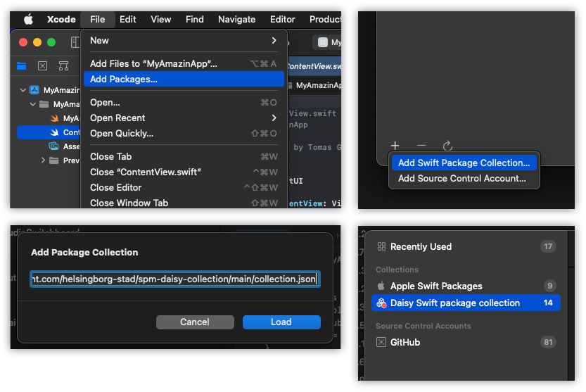

<!-- HEADS UP! To avoid retyping too much info. Do a search and replace with your text editor for the following:
repo_name, project_name -->

<!-- SHIELDS -->
![platform][platform-shield]
[![Contributors][contributors-shield]][contributors-url]
[![Forks][forks-shield]][forks-url]
[![Stargazers][stars-shield]][stars-url]
[![Issues][issues-shield]][issues-url]
[![License][license-shield]][license-url]

<p>
  <a href="https://github.com/helsingborg-stad/spm-daisy-collection">
    
  </a>
</p>

# SPM Daisy Collection
SPM Daisy is a collection of Swift packages that Helsingborg has used to create digital assistants.

## Table of Contents
- [Getting Started](#getting-started)
  - [Prerequisites](#prerequisites)
  - [Installation](#installation)
- [Usage](#usage)
- [Contributing](#contributing)
- [License](#license)


## Getting Started

### Prerequisites

* [Xcode](https://developer.apple.com/xcode/)

### Installation
Add the package collection to Xcode:
- Open a project
- From the Xcode menu select **File** -> **Add Packages**
- At the bottom of the modal view select **+** -> **Add Swift Package Collection**
- Paste `https://raw.githubusercontent.com/helsingborg-stad/spm-daisy-collection/main/collection.json` into the textfield and press load

That's it, now you should be able to see the **Daisy swift package collection** in the navigator and start including packages in to your project!




## Usage
Each package develiers a specific functionality and each of them has documentation on how to use it. For getting started we recommend you have a look at the [assistant](https://github.com/helsingborg-stad/spm-assistant) package.

| Package | Description |
|:--|:--|
| [assistant](https://github.com/helsingborg-stad/spm-assistant)                          | Digital assitant interface
| [audio-switchboard](https://github.com/helsingborg-stad/spm-audio-switchboard)          | Audio service management
| [app-settings](https://github.com/helsingborg-stad/spm-app-settings)                    | Configuration with MDM App Config support
| [automated-fetcher](https://github.com/helsingborg-stad/spm-automated-fetcher)          | Reccuring fetches
| [daisy-ui-components](https://github.com/helsingborg-stad/spm-daisy-ui-components)      | Some SwiftUI components
| [dragoman](https://github.com/helsingborg-stad/spm-dragoman)                            | String localization management
| [fft-publisher](https://github.com/helsingborg-stad/spm-fft-publisher)                  | Audio visualization
| [instagram](https://github.com/helsingborg-stad/spm-instagram)                          | Instagram API interface
| [ms-cognitive-services](https://github.com/helsingborg-stad/spm-ms-cognitive-services)  | Adapted Microsoft Services
| [public-calendar](https://github.com/helsingborg-stad/spm-public-calendar)              | Swedish public calendar
| [shout](https://github.com/helsingborg-stad/spm-shout)                                  | Debug logging
| [stt](https://github.com/helsingborg-stad/spm-stt)                                      | Speech to text
| [tts](https://github.com/helsingborg-stad/spm-tts)                                      | Text to speech
| [text-translator](https://github.com/helsingborg-stad/spm-text-translator)              | Text translation
| [weather](https://github.com/helsingborg-stad/spm-weather)                              | Weather service interface

## Contributing
Any contributions you make are **greatly appreciated**.

1. Fork the Project
2. Create your Feature Branch (`git checkout -b feature/AmazingFeature`)
3. Commit your Changes (`git commit -m 'Add some AmazingFeature'`)
4. Push to the Branch (`git push origin feature/AmazingFeature`)
5. Open a Pull Request

## Developer note
The `collection.json` file is generated by a script provided by apple. In case any packages are added or removed you need go generate a new file.

In order to generate the file you need:
- At least Swift 5.4 installed on your machine
- git installed in your machine
- A github personal accesstoken
- [Download the code][package-collection-generator-sourcecode] from github, choose the latest release-branch
- Open terminal and navigate to source code root

Once the above steps have been completed you run the following command from a terminal (provided you change [PATH TO] and [YOUR TOKEN])
```
swift run package-collection-generate [PATH TO]/spm-daisy-collection/packages.json [PATH TO]/spm-daisy-collection/collection.json --auth-token=[YOUR TOKEN]
```

> At the moment of the 5.5 release you'll get an error for the spm-ms-cognitive-services. Just ignore it, we need apple to patch the script to get it working.

More information on how to use the script is available in the official [Package collection generator readme][package-collection-generator-readme]

## License

Distributed under the [MIT License][license-url].


<!-- MARKDOWN LINKS & IMAGES -->
<!-- https://www.markdownguide.org/basic-syntax/#reference-style-links -->
[contributors-shield]: https://img.shields.io/github/contributors/helsingborg-stad/spm-daisy-collection.svg?style=flat-square
[contributors-url]: https://github.com/helsingborg-stad/spm-daisy-collection/graphs/contributors
[forks-shield]: https://img.shields.io/github/forks/helsingborg-stad/spm-daisy-collection.svg?style=flat-square
[forks-url]: https://github.com/helsingborg-stad/spm-daisy-collection/network/members
[stars-shield]: https://img.shields.io/github/stars/helsingborg-stad/spm-daisy-collection.svg?style=flat-square
[stars-url]: https://github.com/helsingborg-stad/spm-daisy-collection/stargazers
[issues-shield]: https://img.shields.io/github/issues/helsingborg-stad/spm-daisy-collection.svg?style=flat-square
[issues-url]: https://github.com/helsingborg-stad/spm-daisy-collection/issues
[license-shield]: https://img.shields.io/github/license/helsingborg-stad/spm-daisy-collection.svg?style=flat-square
[license-url]: https://raw.githubusercontent.com/helsingborg-stad/spm-daisy-collection/main/LICENSE
[platform-shield]: https://img.shields.io/badge/platform-iOS-blue.svg?style=flat-square
[package-collection-generator-sourcecode]: https://github.com/apple/swift-package-collection-generator
[package-collection-generator-readme]: https://github.com/apple/swift-package-collection-generator/blob/5.5/Sources/PackageCollectionGenerator/README.md
